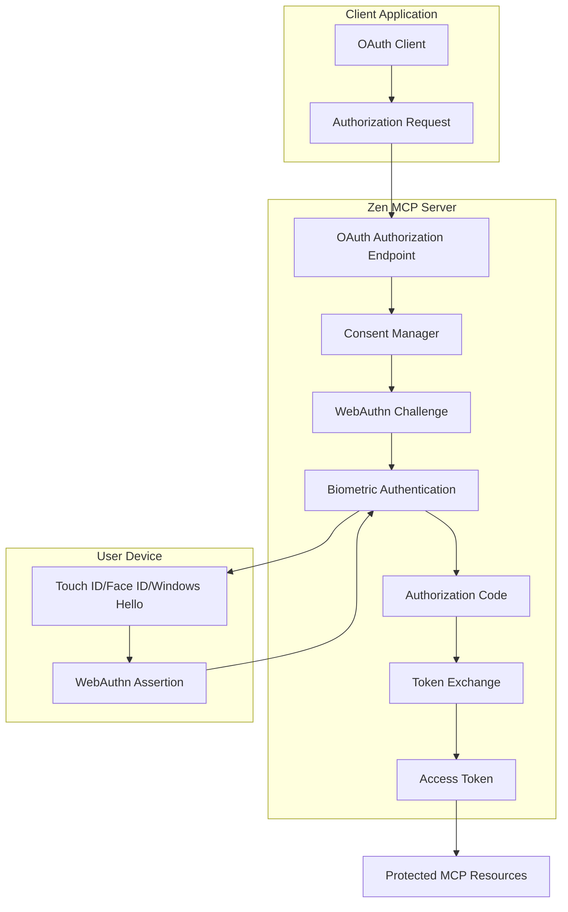

# OAuth 2.0 + WebAuthn Integration for Zen MCP Server

## Overview

This integration provides a complete OAuth 2.0 authorization server with WebAuthn biometric authentication for the Zen MCP Server. It enables secure, passwordless authentication using Touch ID, Face ID, Windows Hello, and hardware security keys while maintaining full OAuth 2.0 compliance.

## Key Features

### 🔐 Security Features
- **Biometric Authentication**: Touch ID, Face ID, Windows Hello integration
- **WebAuthn Standard Compliance**: FIDO2/WebAuthn specification adherence
- **PKCE Support**: Proof Key for Code Exchange for enhanced security
- **Device Binding**: Credentials tied to specific registered devices
- **Multi-Device Support**: Users can authenticate from multiple registered devices
- **Session Management**: Secure session tokens with configurable expiration

### 🚀 OAuth 2.0 Features
- **Authorization Code Flow**: Full OAuth 2.0 authorization code grant
- **Scope Management**: Granular permission control with risk assessment
- **Consent Management**: User consent tracking and approval system
- **Token Management**: Access tokens, refresh tokens, and introspection
- **Client Registration**: Support for OAuth client applications
- **Cross-Device Authorization**: Authorize on one device, authenticate on another

### 🛠 Integration Features
- **Seamless Integration**: Works with existing MCP server infrastructure
- **Backward Compatibility**: Existing WebAuthn flows continue to work
- **Multiple Transport Support**: HTTP, WebSocket, and streaming protocols
- **Real-time Updates**: Server-sent events for authorization flow status
- **Comprehensive Testing**: Full test suite with security validation

## Architecture



## Implementation Components

### Core Files

1. **`oauth2_models.py`** - OAuth 2.0 data models and flow components
   - Authorization requests, codes, and tokens
   - Client registration and validation
   - Scope definitions and management
   - Error handling and security models

2. **`webauthn_flow.py`** - Enhanced WebAuthn with OAuth integration
   - OAuth-aware authentication challenges
   - Authorization code generation
   - Multi-device credential management
   - Token exchange and validation

3. **`oauth_integration.py`** - OAuth authorization server implementation
   - Authorization endpoint with WebAuthn integration
   - Token endpoint for code exchange
   - Consent handling and user interface
   - Security validation and error handling

4. **`oauth_consent.py`** - Advanced consent and scope management
   - Granular scope definitions with risk assessment
   - Dependency resolution and validation
   - Consent tracking across devices
   - User consent history and management

5. **`device_auth.py`** - Enhanced device authentication
   - OAuth endpoint integration
   - Multi-platform biometric support
   - Cross-device flow management
   - Session and consent coordination

### Supporting Files

- **`test_oauth_integration.py`** - Comprehensive test suite
- **`OAUTH_WEBAUTHN_INTEGRATION.md`** - This documentation
- Enhanced HTML demo pages for testing and validation

## OAuth 2.0 Flow Details

### 1. Authorization Request
```http
GET /oauth/authorize?
    client_id=zen-mcp-client&
    redirect_uri=https://app.example.com/callback&
    response_type=code&
    scope=read+tools+profile&
    state=xyz&
    code_challenge=abc123&
    code_challenge_method=S256
```

### 2. User Consent and WebAuthn Challenge
- User reviews requested permissions and scopes
- Risk assessment and dependency resolution
- WebAuthn challenge creation with OAuth context
- Biometric authentication (Touch ID/Face ID/Windows Hello)

### 3. Authorization Code Generation
- WebAuthn assertion verification
- Authorization code creation with:
  - Client validation
  - Scope approval
  - Device binding
  - PKCE challenge storage

### 4. Token Exchange
```http
POST /oauth/token
Content-Type: application/x-www-form-urlencoded

grant_type=authorization_code&
code=AUTH_CODE_HERE&
redirect_uri=https://app.example.com/callback&
client_id=zen-mcp-client&
code_verifier=CODE_VERIFIER_HERE
```

### 5. Token Response
```json
{
  "access_token": "eyJ0eXAiOiJKV1QiLCJhbGc...",
  "token_type": "Bearer",
  "expires_in": 3600,
  "refresh_token": "refresh_token_here",
  "scope": "read tools profile"
}
```

## Scope System

### Standard Scopes

| Scope | Risk Level | Description | Dependencies |
|-------|------------|-------------|--------------|
| `read` | LOW | Read-only access to data | None |
| `write` | MEDIUM | Create/modify data | `read` |
| `tools` | MEDIUM | Execute MCP tools | None |
| `tools:code` | HIGH | Code analysis tools | `tools`, `read` |
| `tools:files` | HIGH | File system operations | `tools`, `write` |
| `admin` | HIGH | Administrative access | None |
| `profile` | LOW | Basic profile information | None |
| `devices` | MEDIUM | Device management | `profile` |
| `sessions` | MEDIUM | Session management | `profile` |
| `offline_access` | MEDIUM | Long-term access | None |

### Risk Assessment

The system automatically calculates risk scores based on:
- Individual scope risk levels (low=1, medium=3, high=5)
- Number of scopes requested
- Scope combinations and dependencies
- Client trust level

## Multi-Device Support

### Device Registration Flow
1. User registers multiple WebAuthn devices
2. Each device gets unique credentials
3. OAuth flows can use any registered device
4. Consent is shared across all user devices

### Cross-Device Authorization
1. **Initiation Device**: Start OAuth flow on any device
2. **Target Device**: Choose which device to authenticate with
3. **WebAuthn Challenge**: Device-specific biometric authentication
4. **Code Generation**: Authorization code linked to authenticated device

### Device Management
- List all registered OAuth-capable devices
- View device-specific consent history
- Revoke individual device access
- Monitor cross-device authorization activity

## Security Features

### WebAuthn Security
- **Biometric Data Protection**: Never stored on server
- **Device Binding**: Credentials tied to specific hardware
- **Challenge-Response**: Unique challenges prevent replay attacks
- **Platform Authenticators**: Secure Enclave/TPM storage

### OAuth Security
- **PKCE Required**: All authorization flows must use PKCE
- **Short-Lived Codes**: Authorization codes expire in 10 minutes
- **One-Time Use**: Codes can only be exchanged once
- **Client Validation**: Strict redirect URI and client validation
- **Scope Validation**: Only pre-approved scopes allowed

### Session Security
- **Secure Cookies**: HTTP-only, secure, SameSite strict
- **Token Expiration**: Configurable access token lifetimes
- **Refresh Rotation**: Refresh tokens rotate on use
- **Revocation Support**: Immediate token and consent revocation

## Configuration

### Environment Variables
```bash
# Enable OAuth + WebAuthn integration
ENABLE_DEVICE_AUTH=true
ENABLE_OAUTH=true

# Domain configuration
AUTH_DOMAIN=kooshapari.com
TUNNEL_DOMAIN=zen.kooshapari.com

# Session settings
AUTH_SESSION_TIMEOUT=28800  # 8 hours
OAUTH_CODE_EXPIRY=600      # 10 minutes
OAUTH_TOKEN_EXPIRY=3600    # 1 hour

# Consent settings
CONSENT_EXPIRY_DAYS=90
REQUIRE_EXPLICIT_CONSENT=true
```

### Client Registration
```python
from auth.oauth2_models import OAuthClient, GrantType

client = OAuthClient(
    client_id="my-mcp-client",
    client_secret="client-secret",  # Optional for public clients
    name="My MCP Application",
    description="OAuth client for my MCP application",
    redirect_uris=[
        "https://myapp.example.com/oauth/callback",
        "http://localhost:3000/callback"  # For development
    ],
    allowed_scopes={"read", "tools", "profile"},
    grant_types={GrantType.AUTHORIZATION_CODE},
    is_public=False,  # Set to True for mobile/SPA apps
    require_pkce=True,
    trusted=False  # Set to True to skip consent for basic scopes
)

# Register with the auth manager
auth_manager.webauthn.register_oauth_client(client)
```

## API Endpoints

### OAuth 2.0 Endpoints
- `GET /oauth/authorize` - Authorization endpoint
- `POST /oauth/consent` - User consent handling  
- `POST /oauth/verify` - WebAuthn verification
- `POST /oauth/token` - Token exchange endpoint
- `POST /oauth/introspect` - Token introspection

### Device Management
- `GET /auth/oauth/devices/{user_id}` - List user devices
- `POST /auth/oauth/device-challenge` - Initiate device-specific challenge
- `POST /auth/oauth/cross-device-verify` - Cross-device verification

### Consent Management
- `GET /auth/oauth/consent-history/{user_id}` - User consent history
- `DELETE /auth/oauth/consent/{user_id}/{client_id}` - Revoke consent

### Discovery
- `GET /.well-known/oauth-authorization-server` - OAuth server metadata
- `GET /.well-known/oauth-protected-resource` - Protected resource metadata

## Testing

### Integration Test Suite
```bash
cd auth
python test_oauth_integration.py
```

The test suite validates:
- Complete OAuth authorization flow
- WebAuthn integration and verification
- Consent management and scope validation
- Multi-device scenarios and cross-device flows
- Security features and error handling
- Token lifecycle management

### Manual Testing
1. Start the server with OAuth enabled:
   ```bash
   ENABLE_DEVICE_AUTH=true python server_mcp_http.py --tunnel
   ```

2. Visit the demo page:
   ```
   https://your-domain.kooshapari.com/auth/demo
   ```

3. Follow the OAuth + WebAuthn flow demonstration

### Security Testing
The integration includes comprehensive security tests:
- Authorization code expiration and one-time use
- PKCE validation and enforcement  
- Client validation and redirect URI checking
- Access token expiration and validation
- Scope enforcement and privilege escalation prevention
- WebAuthn assertion verification and replay protection

## Error Handling

The system provides standard OAuth 2.0 error responses:

### Authorization Errors (redirected to client)
- `invalid_request` - Missing or invalid request parameters
- `unauthorized_client` - Client not authorized for this flow
- `access_denied` - User denied authorization
- `unsupported_response_type` - Only 'code' supported
- `invalid_scope` - Invalid or unauthorized scopes
- `server_error` - Internal server error

### Token Errors (JSON response)
- `invalid_grant` - Invalid or expired authorization code
- `invalid_client` - Invalid client credentials
- `unsupported_grant_type` - Only 'authorization_code' supported

### WebAuthn Errors
- Challenge expiration and validation
- Credential not found or invalid
- Biometric authentication failures
- Cross-device verification errors

## Performance Considerations

### Optimizations
- **In-Memory Storage**: Fast access to active sessions and challenges
- **Challenge Cleanup**: Automatic cleanup of expired challenges
- **Consent Caching**: Cached consent decisions for trusted clients
- **Token Validation**: Efficient token lookup and validation
- **Device Filtering**: Quick filtering of user devices by capability

### Scalability
- **Stateless Design**: All state stored in secure tokens where possible
- **Database Ready**: Easy migration to persistent storage
- **Horizontal Scaling**: No server-side session dependencies
- **Caching Support**: Redis integration ready for session storage

## Migration and Compatibility

### Existing WebAuthn Systems
- **Backward Compatible**: Existing device registrations continue to work
- **Gradual Migration**: OAuth can be enabled alongside existing auth
- **Zero Downtime**: No disruption to existing authenticated users
- **Credential Reuse**: Existing WebAuthn credentials work with OAuth

### Client Applications
- **Progressive Enhancement**: Add OAuth support without breaking existing flows
- **Fallback Support**: Non-OAuth clients can still use basic device auth
- **Migration Path**: Clear upgrade path from basic auth to OAuth

## Future Enhancements

### Planned Features
1. **OpenID Connect Support**: Add identity layer on top of OAuth 2.0
2. **JWT Access Tokens**: Self-contained tokens with embedded claims
3. **Dynamic Client Registration**: RFC 7591 support for client registration
4. **Advanced Consent UI**: Rich consent interface with detailed permissions
5. **Audit Logging**: Comprehensive security and usage logging
6. **Rate Limiting**: Request rate limiting and abuse prevention
7. **Token Binding**: Bind tokens to specific TLS connections or devices

### Integration Opportunities
1. **SSO Integration**: SAML/OIDC identity provider integration
2. **MFA Enhancement**: Additional authentication factors beyond biometrics  
3. **Risk-Based Authentication**: Dynamic authentication requirements
4. **Device Trust**: Device reputation and trust scoring
5. **Federated Identity**: Cross-domain identity federation

## Conclusion

The OAuth 2.0 + WebAuthn integration provides a robust, secure, and user-friendly authorization system for the Zen MCP Server. It combines the security of biometric authentication with the standardization and flexibility of OAuth 2.0, enabling secure access to MCP resources while maintaining an excellent user experience.

The system is production-ready with comprehensive security features, extensive testing, and full compliance with relevant standards. It supports modern authentication patterns while providing a clear migration path for existing systems.

For questions or support, refer to the test suite, demo applications, and comprehensive documentation provided in this integration package.